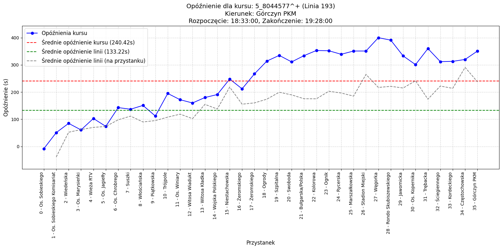

# README - Projekt BIMBA: Pobieranie i Przetwarzanie Danych GTFS

## 📝 **Wprowadzenie**

Projekt **BIMBA** powstał jako część mojego procesu nauki i rozwoju umiejętności w zakresie budowania systemów ETL oraz przetwarzania danych. Głównym celem było opanowanie nowych narzędzi i technologii, a także zrozumienie, jak tworzyć skalowalne rozwiązania przetwarzające duże zbiory danych. W trakcie pracy nad tym projektem zdobyłem cenne doświadczenie i wiedzę, które pozwoliły mi dostrzec jego niedoskonałości oraz obszary do poprawy.

Obecna wersja projektu zawiera rozwiązania, które są wynikiem procesu nauki. Wiele elementów zostało zmienionych i udoskonalonych w miarę zdobywania nowych umiejętności. Niektóre rozwiązania w projekcie znalazły się celowo, aby je przetestować, choć zdaję sobie sprawę z ich niewłaściwego zastosowania. Były one częścią mojego eksperymentowania z różnymi podejściami i technologiami.

Dziś jestem w stanie tworzyć znacznie bardziej zoptymalizowane, skalowalne i profesjonalne systemy ETL oraz pipelines danych. 

Publikuję ten projekt jako świadectwo mojego progresu i punkt wyjścia, który pokazuje, jak wiele się nauczyłem. Wiem, że następna wersja będzie pozbawiona obecnych błędów, nieoptymalnych rozwiązań oraz nieodpowiednio dobranych bibliotek. Moja wiedza umożliwia mi teraz budowanie narzędzi na wyższym poziomie, a ten projekt traktuję jako krok milowy w mojej drodze do perfekcji.

## 📋 **Opis Projektu**

Projekt **BIMBA** to kompleksowy system stworzony z myślą o automatyzacji przetwarzania danych GTFS (General Transit Feed Specification) oraz GTFS-Realtime. System jest narzędziem do zbierania, transformacji i analizowania danych transportu publicznego, co sprawia, że jest wsparciem dla organizacji, które zarządzają, monitorują lub analizują działanie komunikacji miejskiej.

**BIMBA** automatyzuje zbieranie dwóch głównych typów danych:
- **Danych dynamicznych**: pozycje pojazdów w czasie rzeczywistym, aktualizacje podróży (opóźnienia, zmiany trasy) oraz alerty (np. komunikaty o zakłóceniach).
- **Danych statycznych**: szczegółowe informacje o trasach, przystankach, rozkładach jazdy i kształtach tras.

Zebrane dane są przekształcane do wydajnego formatu **Parquet**, który umożliwia szybkie przetwarzanie i analizę dużych zbiorów danych. Finalnie system **BIMBA** integruje dane z bazą PostgreSQL, umożliwiając łatwy dostęp do analiz historycznych oraz bieżących.

--- 

### **Mocne strony projektu BIMBA:**
1. **Skalowalność i wydajność**: 
   - System jest zoptymalizowany pod kątem przetwarzania dużych ilości danych z krótkimi interwałami (co 10 sekund dla danych dynamicznych).
   - Format **Parquet** zapewnia wysoką wydajność zapisu i odczytu danych.
2. **Asynchroniczność**:
   - Wykorzystanie **asyncio** oraz **aiohttp** pozwala na równoczesne pobieranie danych z wielu źródeł, minimalizując czas opóźnienia.
3. **Eliminacja duplikatów i walidacja danych**:
   - System skutecznie usuwa duplikaty oraz weryfikuje integralność danych przy pomocy walidacji `trip_id` oraz unikalnych kluczy głównych.
4. **Rozbudowany proces ETL**:
   - Dane są pobierane, przekształcane, deduplikowane, a następnie ładowane do bazy PostgreSQL w sposób zautomatyzowany.
5. **Modularna architektura**:
   - Każda część systemu (pobieranie, transformacja, ładowanie danych) jest zorganizowana w osobne moduły, co ułatwia utrzymanie i rozwój projektu.
6. **Elastyczność konfiguracji**:
   - Ustawienia takie jak interwały pobierania, źródła danych oraz parametry bazy danych są konfigurowalne poprzez plik `config.yaml`.

---

### **Zastosowania Projektu BIMBA:**
- **Analiza punktualności i opóźnień**:
  Projekt umożliwia analizę opóźnień pojazdów komunikacji publicznej na podstawie danych dynamicznych, co pozwala na monitorowanie jakości usług przewozowych.
- **Optymalizacja tras i rozkładów jazdy**:
  Dzięki analizie danych statycznych i dynamicznych można identyfikować najbardziej problematyczne trasy oraz optymalizować rozkłady w celu poprawy efektywności.
- **Systemy monitorowania w czasie rzeczywistym**:
  Możliwość integracji z systemami wizualizacyjnymi lub mapami do monitorowania pozycji pojazdów na żywo.
- **Raportowanie i statystyki**:
  Dane przetwarzane przez system mogą służyć do generowania raportów dla zarządców transportu publicznego oraz samorządów.
- **Wspieranie planowania rozwoju transportu**:
  Historyczne dane mogą być wykorzystane do planowania nowych linii, przystanków lub wprowadzania ulepszeń w istniejącej infrastrukturze.

---

Głównym celem projektu **BIMBA** jest dostarczenie wydajnego i łatwego w obsłudze narzędzia, które umożliwia przekształcanie surowych danych transportowych w wartościowe informacje analityczne. Dzięki wykorzystaniu nowoczesnych technologii takich jak **asyncio**, **pandas**, **SQLAlchemy** oraz protokołów **GTFS-Realtime** i **GTFS**, system stanowi solidne rozwiązanie dla organizacji zajmujących się analizą i zarządzaniem transportem publicznym.

---

## 🚀 **Struktura Projektu**

```
├── config/                # Konfiguracja projektu
│   ├── config.yaml        # Główne ustawienia projektu
│   └── config.py          # Ładowanie konfiguracji z pliku YAML
├── data_acquisition/      # Moduły pobierania danych
│   ├── fetch_static.py    # Pobieranie danych statycznych GTFS
│   └── fetch_dynamic.py   # Pobieranie danych dynamicznych GTFS-Realtime
├── etl/                   # Moduły ETL (Transformacja danych)
│   ├── transform_pb_to_parquet.py   # Transformacja protobuf do Parquet
│   ├── transform_static_to_parquet.py # Transformacja danych statycznych do Parquet
│   └── gtfs_realtime_pb2.py          # Wygenerowany plik Protobuf
├── parsers/               # Parsery danych GTFS-Realtime
│   ├── trip_update_parser.py        # Parsowanie Trip Updates
│   ├── vehicle_position_parser.py   # Parsowanie pozycji pojazdów
│   └── alert_parser.py              # Parsowanie alertów
├── utils/                 # Narzędzia pomocnicze
│   ├── transformations.py           # Transformacje danych statycznych i dynamicznych
│   ├── logging_config.py            # Konfiguracja logowania
│   ├── last_modified_manager.py     # Zarządzanie metadanymi plików
│   ├── folder_manager.py            # Zarządzanie folderami
│   ├── hash_utils.py                # Obliczanie hashów plików
│   └── db_utils.py                  # Obsługa bazy danych
├── data_loading/          # Moduł ładowania danych do bazy PostgreSQL
│   ├── load_to_db.py              # Główny loader danych
│   ├── schema_manager.py          # Tworzenie tabel w bazie danych
│   └── version_manager.py         # Zarządzanie wersjami danych
├── processed_managers.py  # Zarządzanie przetworzonymi plikami i folderami
├── create_full_trip_view_plus_avg.sql # Skrypt SQL do tworzenia widoków
├── delays.ipynb           # Analiza opóźnień w Jupyter Notebook
├── analizy_maps.ipynb     # Analiza wizualna map
├── main.py                # Główna aplikacja
└── logs/                  # Logi aplikacji
```

---

## 🛠️ **Opis Modułów**

### **1. Konfiguracja Projektu**

- **config.yaml**: Główne ustawienia projektu (URL-e, interwały pobierania, konfiguracja bazy danych).
- **config.py**: Moduł do ładowania konfiguracji YAML.

### **2. Pobieranie Danych (Data Acquisition)**

- **fetch\_static.py**:
  - Pobiera dane statyczne GTFS (ZIP) oraz `vehicle_dictionary.csv`.
  - Rozpakowuje pliki i zapisuje je w formacie Parquet.
- **fetch\_dynamic.py**:
  - Pobiera dane dynamiczne GTFS-Realtime (`trip_updates.pb`, `vehicle_positions.pb`, `feeds.pb`).
  - Pliki zapisywane są w katalogach z ograniczoną liczbą plików.

### **3. ETL (Extract, Transform, Load)**

- **transform\_pb\_to\_parquet.py**:
  - Przekształca pliki protobuf (PB) do formatu Parquet.
  - Wykorzystuje parsery:
    - `trip_update_parser.py`: Parsowanie Trip Updates.
    - `vehicle_position_parser.py`: Parsowanie pozycji pojazdów.
    - `alert_parser.py`: Parsowanie alertów.
- **transform\_static\_to\_parquet.py**:
  - Konwertuje dane statyczne z CSV na Parquet.
- **gtfs\_realtime\_pb2.py**: Wygenerowany plik Protobuf do dekodowania danych GTFS-Realtime.

### **4. Ładowanie Danych do Bazy**

- **load\_to\_db.py**:
  - Ładuje dane statyczne i dynamiczne do bazy PostgreSQL.
  - Usuwa duplikaty i waliduje `trip_id`.
- **schema\_manager.py**: Tworzy tabele w bazie danych, jeśli nie istnieją.
- **version\_manager.py**: Zarządza wersjami danych statycznych.

### **5. Narzędzia (Utils)**

- **transformations.py**: Transformacje i deduplikacje danych.
- **logging\_config.py**: Konfiguracja logowania za pomocą Loguru.
- **last\_modified\_manager.py**: Zarządza znacznikami `Last-Modified` oraz ETag dla plików.
- **folder\_manager.py**: Zarządza folderami z dynamicznymi danymi.
- **hash\_utils.py**: Oblicza hashe plików do porównywania zmian.
- **db\_utils.py**: Obsługuje usuwanie duplikatów przed ładowaniem danych do bazy.

### **6. Zarządzanie Przetworzonymi Danymi**

- **processed\_managers.py**: Zarządza listą przetworzonych plików i folderów, aby uniknąć wielokrotnego przetwarzania tych samych danych.

### **7. Analizy i Wizualizacje**

- **delays.ipynb**: Analiza opóźnień w danych dynamicznych.
- **analizy\_maps.ipynb**: Wizualizacja danych transportowych na mapach.

### **8. Główna Aplikacja**

- **main.py**:
  - Uruchamia główne moduły systemu na podstawie konfiguracji.
  - Obsługuje logowanie i cykliczne przetwarzanie danych.

---

## 🗃️ **Technologie i Biblioteki**

- **Język**: Python 3.9+
- **Biblioteki**:
  - Logowanie: `loguru`
  - Asynchroniczność: `asyncio`, `aiohttp`
  - Przetwarzanie danych: `pandas`
  - Bazy danych: `SQLAlchemy`
  - Zarządzanie plikami: `watchdog`, `zipfile`, `pathlib`
  - GTFS-Realtime: `protobuf`
- **Baza Danych**: PostgreSQL
- **Format Przechowywania**: Parquet

---

## ✅ **Funkcje**

- Automatyczne pobieranie danych statycznych i dynamicznych z ZTM Poznań.
- Transformacja danych do formatu Parquet.
- Wydajne ładowanie danych do bazy PostgreSQL.
- Obsługa wersjonowania danych.
- Logowanie i obsługa błędów.

---

## 🌟 **Dlaczego Ten Projekt?**

Projekt BIMBA jest dowodem na:

- Umiejętność projektowania i implementacji kompletnych systemów ETL.
- Znajomość przetwarzania danych w czasie rzeczywistym.
- Biegłość w pracy z bazami danych SQL oraz formatem Parquet.
- Profesjonalne podejście do logowania, obsługi błędów oraz organizacji kodu.

Jeśli szukasz kogoś, kto potrafi efektywnie przetwarzać dane, tworzyć solidne rozwiązania ETL i dba o jakość kodu, skontaktuj się ze mną! 🚀

---

## 📧 **Kontakt**

- **Imię i nazwisko**: Sebastian Kruszek
- **Email**: automatylicza@gmail.com


# README - Projekt BIMBA: Pobieranie i Przetwarzanie Danych GTFS

## 📝 **Wprowadzenie**

Projekt **BIMBA** powstał jako część mojego procesu nauki i rozwoju umiejętności w zakresie budowania systemów ETL oraz przetwarzania danych. Głównym celem było opanowanie nowych narzędzi i technologii, a także zrozumienie, jak tworzyć skalowalne rozwiązania przetwarzające duże zbiory danych. W trakcie pracy nad tym projektem zdobyłem cenne doświadczenie i wiedzę, które pozwoliły mi dostrzec jego niedoskonałości oraz obszary do poprawy.

Obecna wersja projektu zawiera rozwiązania, które są wynikiem iteracyjnego procesu nauki. Wiele elementów zostało zmienionych i udoskonalonych w miarę zdobywania nowych umiejętności. Niektóre rozwiązania w projekcie znalazły się celowo, aby je przetestować, choć zdaję sobie sprawę z ich niewłaściwego zastosowania. Były one częścią mojego eksperymentowania z różnymi podejściami i technologiami.

Dziś jestem w stanie tworzyć znacznie bardziej zoptymalizowane, skalowalne i profesjonalne systemy ETL oraz pipelines danych. 

Publikuję ten projekt jako świadectwo mojego progresu i punkt wyjścia, który pokazuje, jak wiele się nauczyłem. Wiem, że następna wersja będzie pozbawiona obecnych błędów, nieoptymalnych rozwiązań oraz nieodpowiednio dobranych bibliotek. Moja wiedza umożliwia mi teraz budowanie narzędzi na wyższym poziomie, a ten projekt traktuję jako krok milowy w mojej drodze do perfekcji.

---

## 📊 **Przykład Wizualizacji**

Poniżej przedstawiam przykładową wizualizację danych opóźnień dla jednego z kursów komunikacji miejskiej. Wykres pokazuje opóźnienia na poszczególnych przystankach oraz średnie wartości dla całego kursu i linii:



Wizualizacja ta pozwala łatwo zidentyfikować przystanki, na których opóźnienia są największe, oraz porównać je do średnich wartości dla całej linii.

